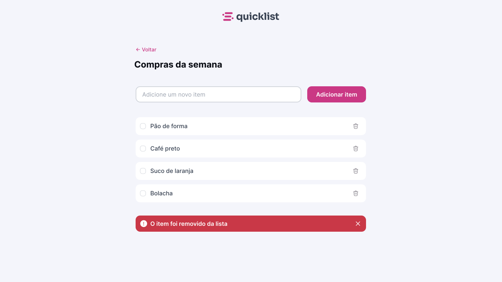

  

O projeto é um site responsivo de lista de compras onde o usuário pode gerenciar os itens adicionando e removendo eles.

  <a href="#-tecnologias">Tecnologias</a>&nbsp;&nbsp;&nbsp;|&nbsp;&nbsp;&nbsp;
  <a href="#-projeto">Projeto</a>&nbsp;&nbsp;&nbsp;|&nbsp;&nbsp;&nbsp;
  <a href="#memo-licença">Licença</a>

  

 

  

## 🚀 Tecnologias

Esse projeto foi desenvolvido com as seguintes tecnologias:

- HTML
- CSS
- Javascript

## Projeto

Nesse projeto desenvolvemos uma Landing Page de uma lista de compras completa e responsiva. de um aplicativo chamado Quicklist.
